<div align="center">
  

  # NightPass
  
  **The privacy-first party and event management DApp on the Midnight Network**

  [](https://github.com/debansh001/NightPass/actions/workflows/ci.yml)
  [](https://github.com/debansh001/NightPass/actions/workflows/frontend.yml)
  [](https://github.com/debansh001/NightPass/actions/workflows/contract.yml)

  <p>
    
    
    
    
    
  </p>

</div>

---

## 💡 About The Product

### The Problem
Traditional event ticketing and RSVP systems are entirely public or highly centralized. When users RSVP to an event on Web2 platforms or transparent Web3 blockchains, their attendance, identity, and connections are exposed to the public or data brokers. For private parties, exclusive events, or discreet gatherings, this lack of privacy is a significant issue. 

### The Solution
**NightPass** leverages the Midnight Network to solve this problem by introducing a **privacy-first RSVP and check-in system**. 
- **Private RSVPs:** Guests can RSVP without revealing their identity or address to the public ledger. 
- **Secure Verification:** The organizer can verify the number of attendees, and guests can securely check in at the door using Zero-Knowledge proofs.
- **Controlled Disclosure:** Only at the moment of physical check-in and fee payment (the privacy boundary) does the guest's identity become public, ensuring that only verified attendees are known, while the initial guest list remains entirely hidden.

---

## 🔒 Privacy-First Model

NightPass is built fundamentally around a privacy-first model, giving users absolute control over what data is public and what remains private.

### Public State vs Private Witness
In the Midnight Network, smart contracts (written in Compact) separate data into two categories:
- **Public State:** Data stored openly on the ledger. In NightPass, this includes the organizer's public key, the entry fee, the maximum list size, the current state of the party (e.g., `READY`, `STARTED`), and the *count* of RSVPs (stored as a hashed commitment set).
- **Private Witness (Local State):** Data stored only on the user's local device. In NightPass, this is the attendee's secret (`_secret`). When an attendee RSVPs, the application uses their private secret to generate a **Zero-Knowledge Proof (ZKP)** locally. The network validates this proof without ever seeing the actual secret.

This separation ensures that the blockchain only stores cryptographic commitments, while sensitive user data never leaves the user's browser.

---

## 📸 Product Screenshots

<div align="center">
  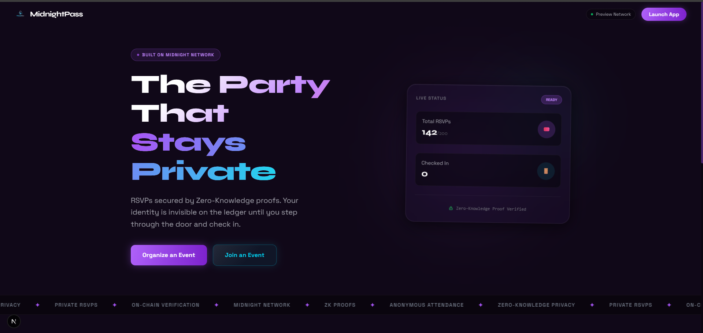
  <p><i>The landing page welcoming users to the NightPass privacy-first application.</i></p>
  
  <br>

  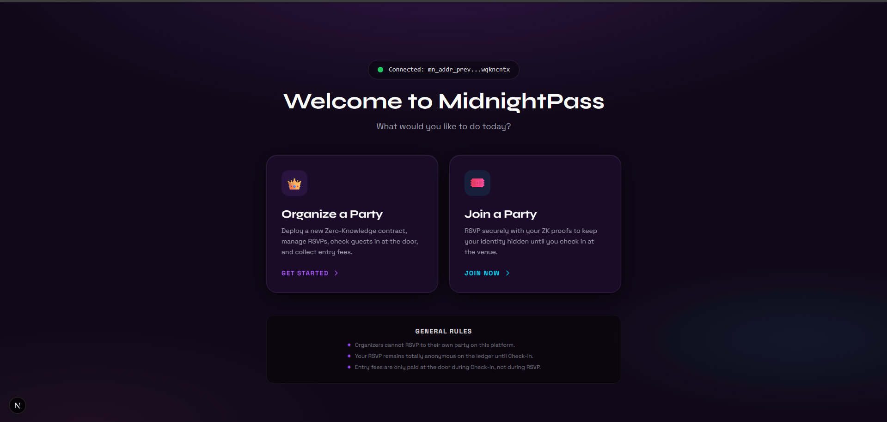
  <p><i>Seamless onboarding flow for both organizers and attendees.</i></p>
  
  <br>

  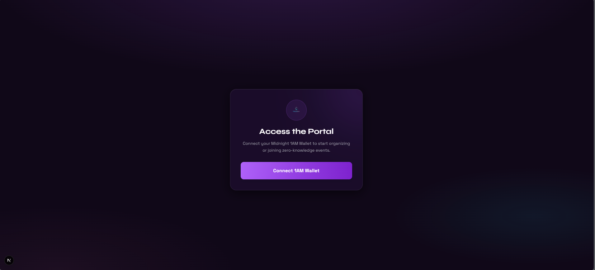
  <p><i>The access portal where users can choose their role to manage or join events.</i></p>

  <br>

  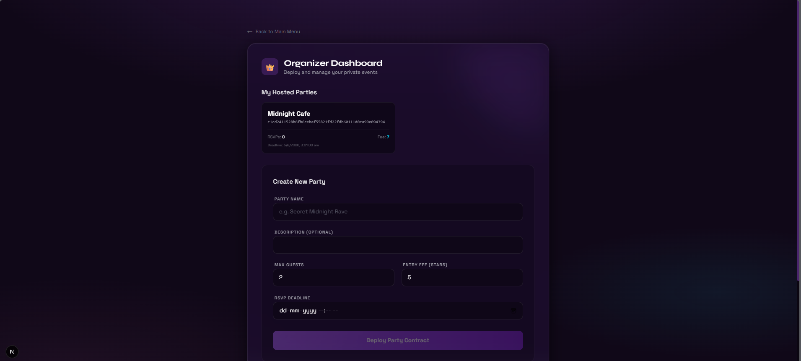
  <p><i>The Organizer Dashboard where hosts can deploy new party contracts with entry fees and deadlines.</i></p>

  <br>

  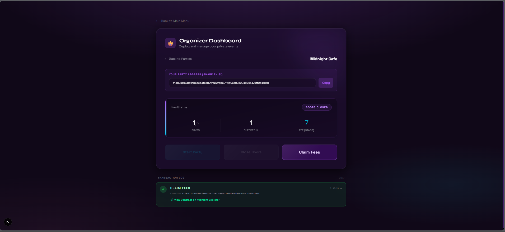
  <p><i>Post-deployment view allowing the organizer to track RSVPs, start the party, and claim fees.</i></p>

  <br>

  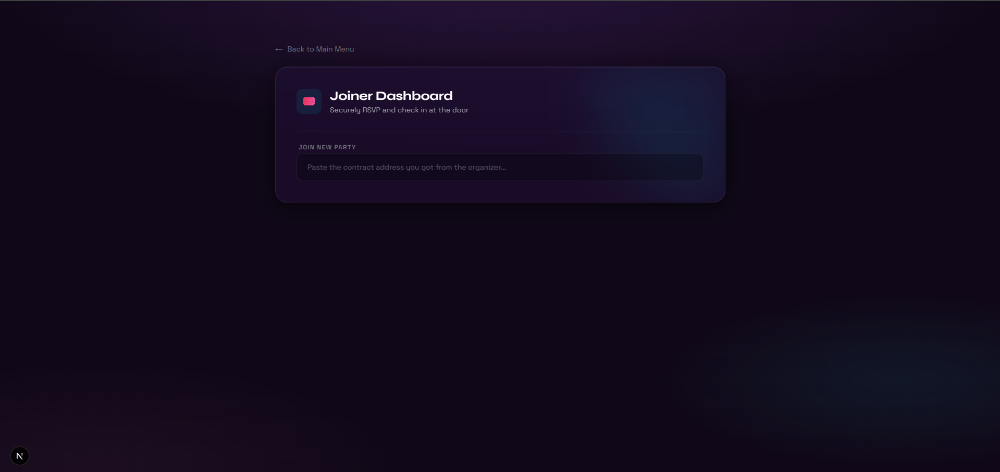
  <p><i>The Joiner Dashboard where attendees can privately RSVP to an event.</i></p>

  <br>

  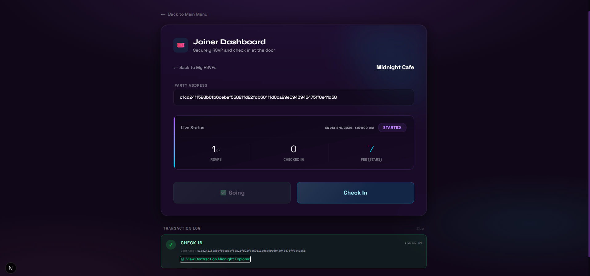
  <p><i>Status confirmation showing the attendee is successfully RSVP'd while retaining full privacy.</i></p>

  <br>

  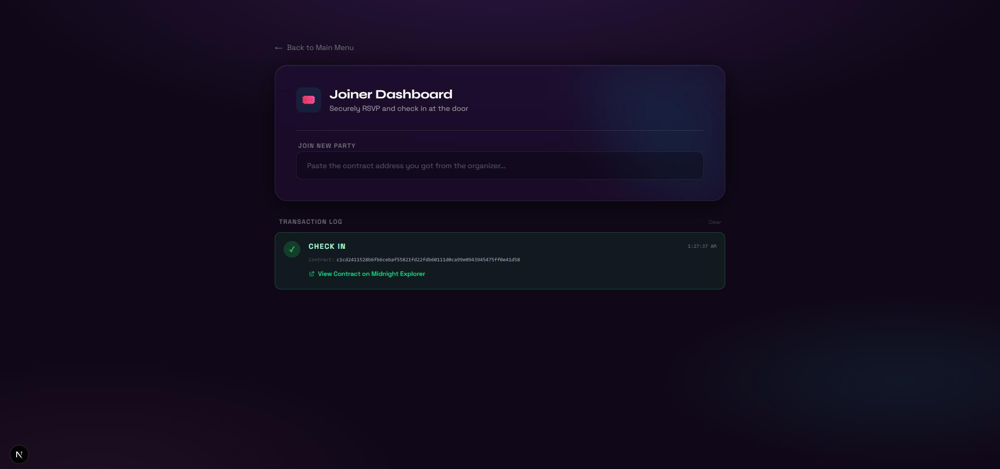
  <p><i>The Check-In phase where attendees cross the privacy boundary to reveal their identity and pay the fee.</i></p>
</div>

---

## 📜 Smart Contracts

The core of NightPass is the `private-party.compact` contract, written in Midnight's Compact language. 

### Key Circuits
- `constructor`: Deploys the contract, setting the max capacity, entry fee, and binding the organizer's identity.
- `rsvp`: Allows an attendee to privately add their commitment hash to the guest list (`hashedPartyGoers`) using a ZK proof.
- `startParty`: The organizer officially starts the event, allowing check-ins to begin.
- `checkIn`: An attendee crosses the privacy boundary, proving they were on the RSVP list, paying the unshielded entry fee, and revealing their address on-chain.
- `closeEntry` / `claimFees`: The organizer closes the doors and claims the accumulated entry fees via an unshielded token transfer.

## 🏗️ Project Architecture

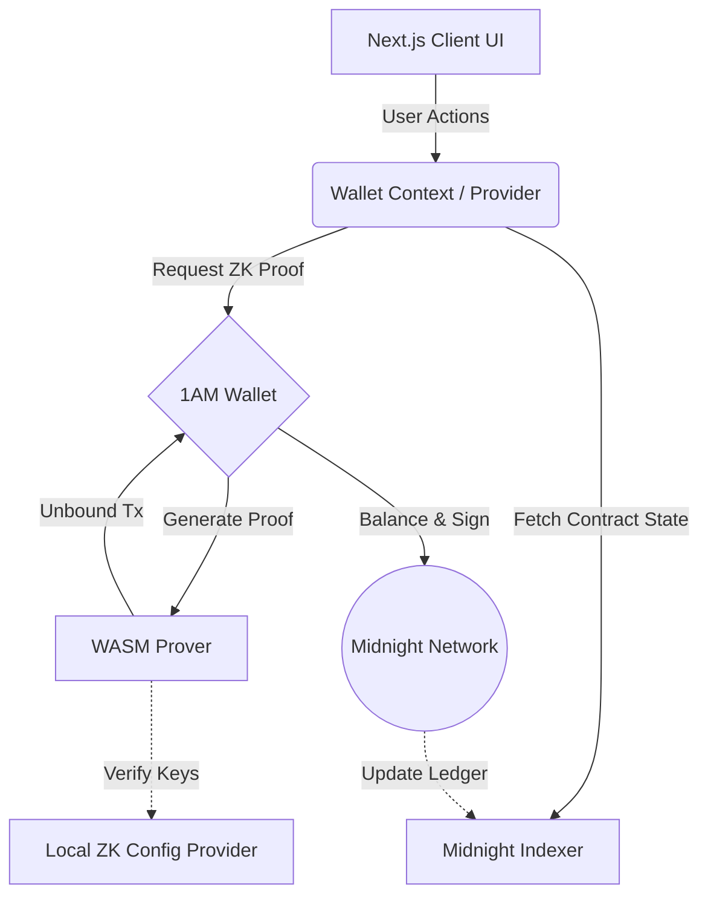

---

## 🔄 User Workflow

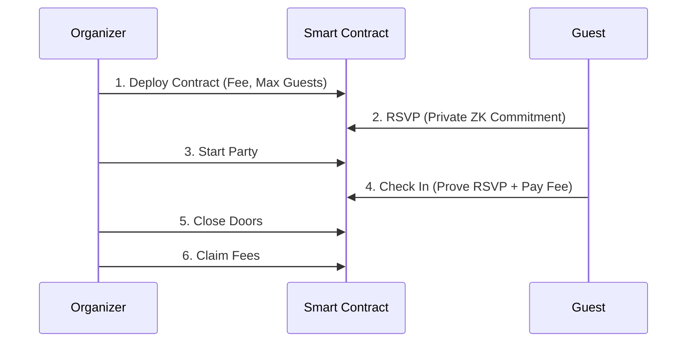

---

## 📂 File Structure

```text
NightPass/
├── app/
│   ├── app/                 # DApp routes
│   │   ├── dashboard/       # Main entry point
│   │   ├── organize/        # Organizer UI (Deploy, Start, Close, Claim)
│   │   └── join/            # Attendee UI (RSVP, Check In)
│   ├── layout.tsx & globals.css # Global styles and layouts
├── components/              # Reusable React components (TxCard, Navigation)
├── contract/                
│   ├── src/private-party.compact # The core smart contract
│   └── src/index.ts         # Contract artifact exports
├── lib/                     # Core application logic
│   ├── midnight.ts          # Wallet connection, SDK providers, and ZK config
│   ├── party.ts             # Contract interaction wrappers (deployParty, rsvp, etc)
│   └── secret.ts            # LocalStorage secret management
└── public/zk/private-party/ # Compiled ZK proving keys and IR
```

---

## 🧪 Testing

### How to Test
NightPass uses the Midnight Network's recommended testing approach. The contract logic can be tested using the `@midnight-ntwrk/compact-runtime` to simulate local network states.

To run the local test harness (if set up via Docker devnet):
```bash
npm run test:local
```

<div align="center">
  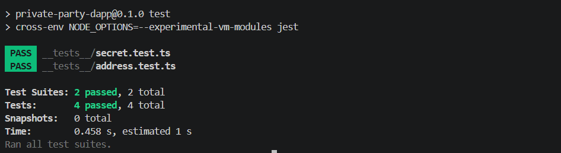
  <p><i>Successful execution of automated unit tests validating the core logic.</i></p>
</div>

---

## 🚀 How to Run Locally

### 1. Set up the 1AM Wallet
1. Download and install the **1AM Wallet** extension for your browser.
2. Create a new wallet or import an existing one.
3. Switch the wallet network to **Preview** (or Preprod, matching the application).
4. Fund your wallet with `tNIGHT` tokens from the [Midnight Faucet](https://faucet.preview.midnight.network/).

### 2. Install Dependencies
Ensure you have Node.js 20+ installed.
```bash
npm install
npm run postinstall
```

### 3. Compile the Contract and Sync Assets
Compile the Compact contract and sync the generated ZK assets to the public folder:
```bash
npm run compact
npm run sync:assets
```

### 4. Start the Development Server
```bash
npm run dev
```
Open `http://localhost:3000` in your browser. Connect your 1AM wallet and start organizing or joining private parties!

### Run with Docker
Build the production image:
```bash
docker build -t nightpass .
```

Run it with the required database and network configuration:
```bash
docker run --rm -p 3000:3000 \
  --env-file .env.local \
  nightpass
```

The container serves the app at `http://localhost:3000`. Copy `.env.example` to `.env.local` and set `DATABASE_URL` before starting the container.

---

## 🔮 Future Implementation & Real World Application

### Future Implementations
- **Dynamic Pricing:** Implement tiers for early-bird RSVPs versus late check-ins.
- **Token-Gated Perks:** Issue soulbound tokens (SBTs) upon successful check-in for attendees to claim exclusive physical or digital merchandise.
- **Event Discovery:** A privacy-preserving event discovery feed where organizers can broadcast public metadata while keeping the RSVP list hidden.

### Real World Applications
- **Exclusive VIP Events:** High-profile events where attendee privacy and security are paramount, preventing paparazzi or unwanted attention from knowing the guest list.
- **Corporate Seminars & Offsites:** Internal corporate events that require absolute confidentiality regarding who is attending from which departments or rival companies.
- **Underground Music & Art Shows:** Secret pop-up events that rely on word-of-mouth and private registries to maintain exclusivity and avoid gate-crashers.
